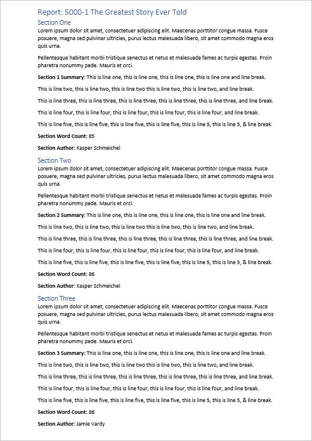

# Refinement Rules Example

## Summary

This PnP template contains a Microsoft Syntex Document Understanding model used to demonstrate the new refinement rules functionality that can be added to extractors.
Refinement rules are ran on the returned entity values from an extractor i.e remove duplicates, select first/last value or line etc.



All five refinement rules currently available to be used are demonstrated in this model.

The sample features the following:

- Classifier
- 7 extractors
- 7 training files (7 positive examples, 1 negative example)

The extractors in this model are:

Extractor Name|Explanation Count|Types|Refinement Rule
--------------|-----------------|-----------------|-----------------
Section Authors|1|Phrase List| 
Section Authors (First Named)|1|Phrase List| Keep one or more of the first values
Section Authors (Last Named)|1|Phrase List| Keep one or more of the first values
Section Authors (No Duplicates)|1|Phrase List| Remove duplicate values
Section 1 Summary|2|Phrase List|
Section 1 Summary (First Line)|2|Phrase List| Keep one or more of the first lines
Section 1 Summary (Last Line)|2|Phrase List| Keep one or more of the last lines

## Using the model

To use the model in your tenant you must have access to a Content Center.

To upload the model, apply the PnP site template to a content center using [PnP PowerShell](https://pnp.github.io/powershell/):

```powershell
Connect-PnPOnline -Url "https://contoso.sharepoint.com/sites/yourContentCenter"

Invoke-PnPSiteTemplate -Path .\RefinementRuleExample.pnp
```

Further details on refinement rules can be found at: [SharePoint Syntex: Testing Out New Refinement Rules for Document Understanding Extractor Models](https://www.leonarmston.com/2022/04/sharepoint-syntex-testing-out-new-refinement-rules-for-document-understanding-extractor-models/)

## Sample

You can find the model source code including training files here: [/models/Refinement-Rules-Example](https://github.com/pnp/syntex-samples/tree/main/models/Refinement-Rules-Example)

Solution|Author(s)
--------|---------
RefinementRuleExample.pnp | [Leon Armston](https://github.com/LeonArmston)

## Version history

Version|Date|Comments
-------|----|--------
1.0|Apr 26, 2022 |Initial release

## Disclaimer

**THIS CODE IS PROVIDED *AS IS* WITHOUT WARRANTY OF ANY KIND, EITHER EXPRESS OR IMPLIED, INCLUDING ANY IMPLIED WARRANTIES OF FITNESS FOR A PARTICULAR PURPOSE, MERCHANTABILITY, OR NON-INFRINGEMENT.**

---

