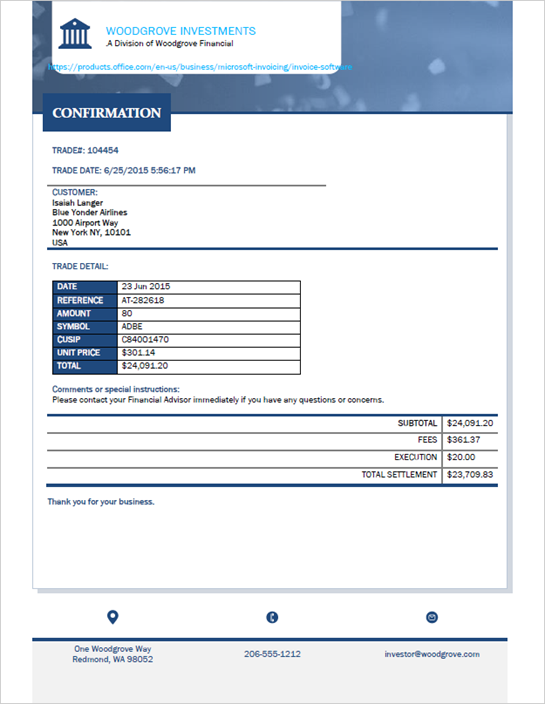

# Trade Confirmation

## Summary

This PnP template contains a SharePoint Syntex Document Understanding model used to classify Trade Confirmations.



The sample features the following:

- Classifier
- 7 extractors
- 15 training files (11 positive examples, 4 negative examples)

The extractors in this model are:

Extractor Name|Explanation Count|Types
--------------|-----------------|-----------------
Cusip|1|Phrase List
Ticker|1|Phrase List
Customer|1|Phrase List
Amount|1|Phrase List
Price|1|Phrase List
Total|2|Phrase List
Trade Date|2|Phrase List

## Using the model

To use the model in your tenant you must have access to a Content Center.

To upload the model, apply the PnP site template to a content center using [PnP PowerShell](https://pnp.github.io/powershell/):

```powershell
Connect-PnPOnline -Url "https://contoso.sharepoint.com/sites/yourContentCenter"

Invoke-PnPSiteTemplate -Path .\TradeConfirmation.pnp
```

## Sample

You can find the model source code including training files here: [/models/Trade-Confirmation](https://github.com/pnp/syntex-samples/tree/main/models/Trade-Confirmation)

Solution|Author(s)
--------|---------
TradeConfirmation.pnp| [James Eccles](https://github.com/jameseccles)

## Version history

Version|Date|Comments
-------|----|--------
1.0|May 11, 2021 |Initial release
1.1|September 10, 2021 | Added Trade Date extractor

## Disclaimer

**THIS CODE IS PROVIDED *AS IS* WITHOUT WARRANTY OF ANY KIND, EITHER EXPRESS OR IMPLIED, INCLUDING ANY IMPLIED WARRANTIES OF FITNESS FOR A PARTICULAR PURPOSE, MERCHANTABILITY, OR NON-INFRINGEMENT.**


